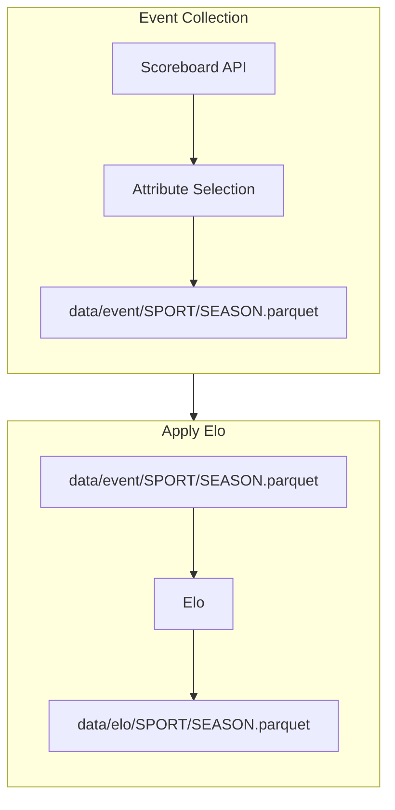

# ELO Rating

## ETL process for Generating Elo Ratings from the ESPN API

This service will:
1. Extract data from the ESPN API
2. Handle attribute selection from the sport event payloads
3. Apply ELO calculations to each event
4. Store ELO for each sport and handle upsert logic as needed

## Resources
- [ELO Rating](https://en.wikipedia.org/wiki/Elo_rating_system)
- [538 Elo](https://github.com/fivethirtyeight/nfl-elo-game/tree/master)
- [ESPN Api Hidden Docs](https://gist.github.com/nntrn/ee26cb2a0716de0947a0a4e9a157bc1c)
- [Github Actions Trigger Python Script](https://canovasjm.netlify.app/2020/11/29/github-actions-run-a-python-script-on-schedule-and-commit-changes/)
- [Github Actions Setup Python](https://github.com/actions/setup-python/tree/main)
- [Github Actions Pricing](https://docs.github.com/en/billing/managing-billing-for-github-actions/about-billing-for-github-actions)

## Future
- ESPN ORM: Map all endpoints to pydantic classes for validation and structure
- More sports
- Advanced ELO systems: The current system uses a basic static k value, more advanced systems improve upon that by implementing a dynamic k value and a dynamic home_field_advantage factor
- Dockerized runner 