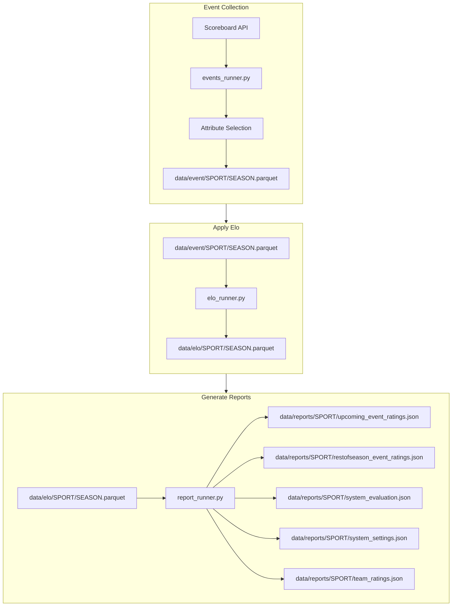

# ELO Rating

   

## ETL process for Generating Elo Ratings from the ESPN API

This service will:
1. Extract data from the ESPN API
2. Handle attribute selection from the sport event payloads
3. Apply ELO calculations to each event
4. Store ELO for each sport and handle upsert logic as needed
5. Generate updated reports on each elo system for:
    1. Upcoming Event Ratings: ELO ratings for Events in the next 2-7 days
    2. Rest of Season Event Ratings: ELO ratings for the rest of the season (simulates rest of season)
    3. System Evaluation: Performance metrics for the system (All time, This Season, Last Season, ...)
        1. Accuracy, Precision, Recall, F1, AUC, Brier Score, Log Loss, System Score (25 - Brier Score * 100)
        2. Number of records: Number of games making up the evaluation report
        3. Avg Number of Games Played: The average number of games played for a team across the evaluation slice
        4. Avg Points per Game: The average number of points scored for a team across the evaluation slice
        5. Home Win Percentage: The amount of times the home team won for all the games in the evaluation slice
    4. System Settings: Current System Hyperparameters and info about number of teams and number of seasons
    5. Team Ratings: Current ELO Ratings and Rankings for the system

## Github Pages
[Site Link](https://theedgepredictor.github.io/elo-rating)

Adds visuals for latest reports 

## Active Sports
- Baseball
  - MLB
  - College Baseball
- Basketball
  - NBA
  - Mens College Basketball
- Football
  - NFL
  - College Football
- Hockey
  - NHL
  - Mens College Hockey
- Lacrosse
  - PLL
  - Mens College Lacrosse

## Resources
- [ELO Rating](https://en.wikipedia.org/wiki/Elo_rating_system)
- [538 Elo](https://github.com/fivethirtyeight/nfl-elo-game/tree/master)
- [ESPN Api Hidden Docs](https://gist.github.com/nntrn/ee26cb2a0716de0947a0a4e9a157bc1c)
- [Github Actions Trigger Python Script](https://canovasjm.netlify.app/2020/11/29/github-actions-run-a-python-script-on-schedule-and-commit-changes/)
- [Github Actions Setup Python](https://github.com/actions/setup-python/tree/main)
- [Github Actions Pricing](https://docs.github.com/en/billing/managing-billing-for-github-actions/about-billing-for-github-actions)

## Future
- ESPN ORM: Map all endpoints to pydantic classes for validation and structure
- Add Soccer Leagues
- Advanced ELO systems: The current system uses a basic static k value, more advanced systems improve upon that by implementing a dynamic k value and a dynamic home_field_advantage factor
- Dockerized runner 